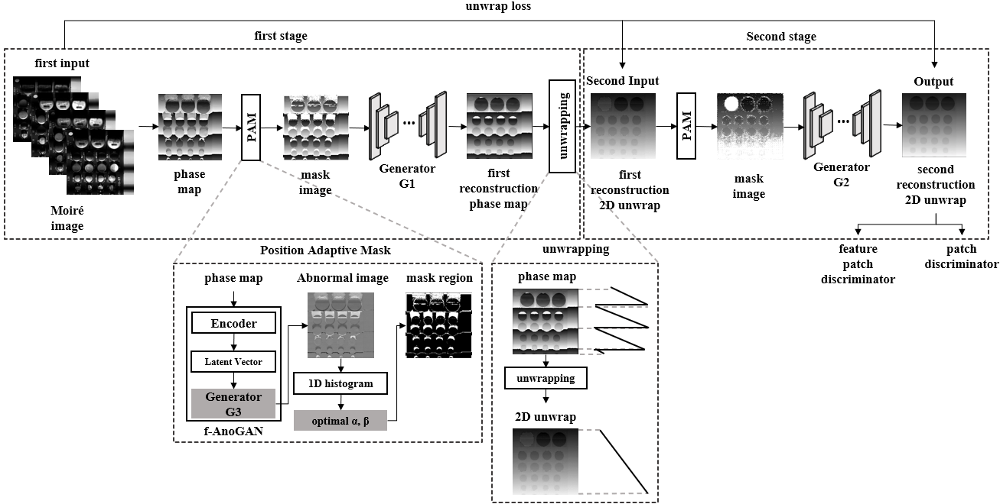

# MIN: Moiré Inpainting Network with Position Adaptive Mask for 3D Height Reconstruction
[IEEE Xplore](https://ieeexplore.ieee.org/document/10902408) |[IEEE ACCES 2025 paper](https://ieeexplore.ieee.org/document/10902408/pdf)| [BibTex](#jump1)

-----------
## 요약
<!-- 2. 그림자/둥근 모서리 CSS 적용 -->
<div align="center">
  
</div>

<details>
 <summary> 2D PCB 영상의 정확한 3D 높이 복원을 위해 모아레 방식의 문제점을 해결하는 생성형 모델을 설계 </summary>

- 모아레 패턴(Moire pattern)이란 주기적인 파형들이 겹쳐 생성되는 물결무늬를 말합니다. 모아레 광학계를 통해 객체에 모아레 패턴을 투영하여 모아레 영상을 취득합니다. 모아레 영상 복원은 이러한 2D 모아레 영상을 통해 3D 높이로의 복원을 진행하는 과정입니다.

- 인쇄회로기판(PCB, Printed Circuit Board)의 불량 검사를 위해 모아레 영상 복원을 사용합니다. 일상 속 전자제품의 핵심 기능을 담당하는 PCB의 불량 여부는 매우 중요하며, 불량 여부를 판별하기 위해 3D 높이 정보를 필요로합니다.

- 이때 모아레 영상 복원에 그림자와 빛 반사라는 치명적인 문제점으로 인해 PCB의 제대로 된 높이 복원이 진행되지 않습니다. 이를 해결하고자 생성형 모델 기반의 인페인팅 모델인 MIN(Moire Inpainting Network)를 설계하여 그림자와 빛 반사를 재구성합니다. 이 과정에서 그림자와 빛 반사 영역을 정밀하게 정의하기 위해 생성형 모델 기반의 이상치 감지 모델 f-AnoGAN을 활용합니다.

- 최종적으로 2D PCB 영상 속 부품들에 대해 정확한 3D 높이로의 복원을 진행하여 불량 검사를 진행합니다.

</details>

-------------

## 제안 방식

#### 모델 구조

<details>
 <summary> 두 스테이지 구조로 두 번에 걸쳐 그림자와 빛 반사를 복원하여 정확한 PCB 높이 복원까지의 과정 </summary>

- MIN (Moire Inpainting Network) 모델은 두 스테이지(First stage, Second stage)로 나뉘어 두 번에 걸쳐 그림자와 빛 반사 영역을 복원합니다.

- 첫 번째 스테이지에서는 위상 맵(Phase map)에서의 그림자와 빛 반사 영역을 복원합니다.

- 두 번째 스테이지에서는 첫 번째 스테이지 결과를 위상 펼침한 펼쳐진 위상 맵(2D Unwrap)에서의 그림자와 빛 반사 영역을 복원합니다.

- 최종적으로 복원된 펼쳐진 위상 맵으로 정확한 PCB 높이 복원이 가능합니다.

</details>

<div align="center">
  
</div>

#### 이상치 감지 모델 구조

<details>
 <summary> 그림자와 빛 반사 영역을 정밀하게 정의하기 위한 핵심 생성형 기반 영상 이상치 감지 모델 </summary>

- PAM (Position Adaptive Module)은 복원에 앞서 정밀한 그림자와 빛 반사 영역을 찾기 위해 설계된 모듈입니다.

- f-AnoGAN(fast unsupervised anomaly detection with
generative adversarial networks)는 생성형 모델 기반의 이상치 감지 모델로 PAM의 핵심 기능을 담당합니다.

- f-AnoGAN 모델을 활용한 PAM을 통해 정밀한 그림자와 빛 반사 영역을 정의할 수 있습니다.

</details>

<div align="center">
  
</div>


-------------

## 데이터셋

<details>
 <summary> 모아레 광학계(좌)를 통해 노이즈 데이터 취득, 현미경(우)를 통해 정답 데이터 취득 </summary>

- 노이즈(그림자, 빛 반사) 데이터: 자체 제작한 그림자와 빛 반사가 존재하는 2D PCB 모아레 영상을 활용하였습니다.
연구실내 보유중인 모아레 광학계(좌측 그림)를 통해 각 PCB 별 모아레 영상을 취득하여 학습에 사용하였습니다.

- 정답 데이터: 그림자와 빛 반사가 존재하지 않는 정답 2D PCB 모아레 영상의 경우 연구실내 보유중인 현미경(우측 그림)을 통해 실제 높이 값을 측정하여 제작되었고, 이를 학습에 사용하였습니다.

</details>

<div align="center">
  
</div>

<details>
 <summary> 취득된 데이터의 모습 </summary>

- 노이즈 데이터는 모아레 광학계를 통해 취득된 실제 PCB 영상(PCB image)에 대한 4장의 모아레 영상(0도, 90도, 180도, 270도) 입니다.

- 정답 데이터는 현미경을 통해 취득된 실제 PCB 높이 값(real PCB height value)을 이용하여 평면(ground)에 투영된 모아레 영상을 가지고 데이터를 생성합니다.

</details>

<div align="center">
  
</div>

--------------

## 코드 설명


<details>
 <summary> MIN(Moire Inpainting Network) 모델 </summary>
  
  * [모델 전체 코드](models/MIN.py)
    * [제안하는 손실함수](https://github.com/kkimtaejung/Research-for-Moire-3D-Reconstruction/blob/main/models/MIN.py#L33-L84)
    
    : 복원된 펼쳐진 위상 맵에 대한 균일함을 평가하는 Uniform loss, 높이 차이의 동일함을 평가하는 Height difference loss 설계
    * [모델 초기화](https://github.com/kkimtaejung/Research-for-Moire-3D-Reconstruction/blob/main/models/MIN.py#L91-L218)
    
    : 첫 번째 스테이지 입력 위상 맵과 마스크, 두 번째 스테이지 입력 펼쳐진 위상 맵과 마스크 정의, 각 스테이지별 판별자, 생성자 정의, 파라미터 정의
    * [데이터 사전처리](https://github.com/kkimtaejung/Research-for-Moire-3D-Reconstruction/blob/main/models/MIN.py#L220-L257)
    
    : 마스크 생성 과정을 기존과 달리 임의로 지정 (그림자와 빛 반사 영역에 대해)
    * [PAM(Position Adaptive Mask)](https://github.com/kkimtaejung/Research-for-Moire-3D-Reconstruction/blob/main/models/MIN.py#L260-L329)
    
    : f-AnoGAN 학습된 모델로 이상치 영상 취득, 이상치 영상을 활용해 마스크 영상 생성
    * [모델 학습 과정](https://github.com/kkimtaejung/Research-for-Moire-3D-Reconstruction/blob/main/models/MIN.py#L331-L393)
    
    : 학습 과정에서는 정답(그림자와 빛 반사가 없는)에 대해서만 학습을 진행
    * [모델 테스트 과정](https://github.com/kkimtaejung/Research-for-Moire-3D-Reconstruction/blob/main/models/MIN.py#L403-L465)
    
    : 테스트 과정에서는 노이즈(그림자와 빛 반사가 존재하는)에 대해 테스트를 진행하며, 첫 스테이지 결과가 두 번째 스테이지로 이어짐
    * [모델 파라미터 갱신](https://github.com/kkimtaejung/Research-for-Moire-3D-Reconstruction/blob/main/models/MIN.py#L468-L596)
    
    : 각각의 판별자, 생성자 갱신 과정에서 제안하는 손실함수 적용
    * [학습 출력 로그](https://github.com/kkimtaejung/Research-for-Moire-3D-Reconstruction/blob/main/models/MIN.py#L598-L608), [학습/테스트 결과 시각화](https://github.com/kkimtaejung/Research-for-Moire-3D-Reconstruction/blob/main/models/MIN.py#L610-L620), [학습된 모델 저장](https://github.com/kkimtaejung/Research-for-Moire-3D-Reconstruction/blob/main/models/MIN.py#L622-L629), [테스트 모델 로드](https://github.com/kkimtaejung/Research-for-Moire-3D-Reconstruction/blob/main/models/MIN.py#L631-L634)

</details>

<details>

<summary> 모델 파라미터 설정 </summary> 

  * [모델 사전 설정 코드](train.py)
    
    * [데이터 경로 로드 설정](https://github.com/kkimtaejung/Research-for-Moire-3D-Reconstruction/blob/main/train.py#L25-L27)
    
    : 모아레 영상과 마스크 영상이 담긴 폴더 경로 입력
    * [파라미터 설정](https://github.com/kkimtaejung/Research-for-Moire-3D-Reconstruction/blob/main/train.py#L28-L79)
    
    : 모델 학습에 앞서 제약 조건을 정의
    * [학습 데이터 전처리 설정](https://github.com/kkimtaejung/Research-for-Moire-3D-Reconstruction/blob/main/train.py#L81-L87)
    
    : 토치 변환, 정규화 등 실제 데이터 로드
    * [모델 로드 및 로그 설정](https://github.com/kkimtaejung/Research-for-Moire-3D-Reconstruction/blob/main/train.py#L89-L100)
    
    : 모델 생성/로드/저장, 학습 수, 학습 시간, loss 로그 TXT 파일 생성

</details>

<details>

<summary> 학습 데이터 불러오기 </summary> 

  * [실제 데이터 로드 코드](util/data_load.py) 입니다.
  
    * [데이터 파일 로드](https://github.com/kkimtaejung/Research-for-Moire-3D-Reconstruction/blob/main/util/data_load.py#L20-L27)
    
    : 지정 형식에 따른 폴더 속 영상 및 마스크 파일 로드 및 정렬
    * [데이터 전처리](https://github.com/kkimtaejung/Research-for-Moire-3D-Reconstruction/blob/main/util/data_load.py#L29-L49)
    
    : 영상 및 마스크 크기 재설정, 토치 변환, 정규화 과정을 통해 학습에 맞게 재구성

</details>

<details>

<summary> 모델 학습 </summary> 

  * [모델 학습 코드](train.py)
    
    * [모델 저장](https://github.com/kkimtaejung/Research-for-Moire-3D-Reconstruction/blob/main/train.py#L103-L110)
    
    : 모델 저장 주기, 경로 설정
    * [모델 학습 진행](https://github.com/kkimtaejung/Research-for-Moire-3D-Reconstruction/blob/main/train.py#L113-L130)
    
    : 영상 및 마스크 전처리 후 모델에 입력 및 학습, loss 갱신
    * [학습 결과 저장](https://github.com/kkimtaejung/Research-for-Moire-3D-Reconstruction/blob/main/train.py#L133-L153)
    
    : 학습 후 결과 시각화하여 저장, 학습 수, 학습 시간 등 정보 출력

</details>

<details>

<summary> 테스트 데이터 불러오기 </summary> 

  * [테스트 데이터 로드 코드](util/data_load_test.py)
    * [데이터 파일 로드](https://github.com/kkimtaejung/Research-for-Moire-3D-Reconstruction/blob/main/util/data_load_test.py#L20-L26)
    
    : 앞선 학습과 달리 스테이지 마다 다른 영상이 입력되지 않고, 한 입력 영상으로 복원 진행
    * [데이터 전처리](https://github.com/kkimtaejung/Research-for-Moire-3D-Reconstruction/blob/main/util/data_load_test.py#L28-L41)
    
    : 학습 과정과 동일

</details>

<details>

<summary> 학습된 모델 테스트 </summary> 

  * [모델 테스트 코드](test.py)
    
    * [학습 모델 로드](https://github.com/kkimtaejung/Research-for-Moire-3D-Reconstruction/blob/main/test.py#L108-L110)
    
    : 학습된 모델 불러와 테스트에 활용
    * [테스트 데이터 전처리](https://github.com/kkimtaejung/Research-for-Moire-3D-Reconstruction/blob/main/test.py#L116-L122)
    
    : 학습 과정과 동일
    * [테스트 결과 시각화](https://github.com/kkimtaejung/Research-for-Moire-3D-Reconstruction/blob/main/test.py#L125-L128)
    
    : 학습 과정과 동일, 결과 최종적으로 복원된 펼쳐진 위상 맵(Unwrap)으로 높이 복원 가능

</details>

--------------

## 실행 가이드라인

* 레포지토리 클론
    ```
    git clone https://github.com/kkimtaejung/Research-for-Moire-3D-Reconstruction.git
    ```
* 가상환경에 라이브러리 설치
    ```
    pip install -r requirements.txt
    ```
* train.py 에 데이터셋 경로 할당
    ```
    self.dataroot= r'첫 번째 스테이지(First stage)의 정답 2D PCB 위상 맵(Phase map) 폴더 경로'
    self.maskroot= r'그림자와 빛 반사 영역에 대한 마스크 영상 폴더 경로'
    self.unwraproot = r'두 번재 스테이지(Second stage)의 정답 2D PCB 펼쳐진 위상 맵(Unwrap) 폴더 경로'
    ```
* 학습된 [f-AnoGAN](https://github.com/tSchlegl/f-AnoGAN) 모델 파일을 아래의 위치에 저장 (사전 학습된 모델 파일 [PCB1, PCB2, PCB3](https://drive.google.com/drive/folders/1qUL9Ps7Nco9pV27ChnksvblpD24lYnpv?usp=sharing))
    ```
    models/results/PCB1/discriminator
    models/results/PCB1/encoder
    models/results/PCB1/generator
    ```
* 학습 시작
    ```
    python train.py
    ```
* 테스트 시작
    ```
    python test.py
    ```


--------------

## <span id="jump1">Citation</span>
```
@ARTICLE{10902408,
  author={Kim, Tae-Jung and Ha, Min-Ho and Arshad, Saba and Park, Tae-Hyoung},
  journal={IEEE Access}, 
  title={MIN: Moiré Inpainting Network With Position Adaptive Mask for 3-D Height Reconstruction}, 
  year={2025},
  volume={13},
  number={},
  pages={37501-37513},
  keywords={Image reconstruction;Printed circuits;Reflection;Generative adversarial networks;Context modeling;Height measurement;Integrated circuit modeling;Computational modeling;Solid modeling;Adaptive systems;Artificial intelligence;computer vision;generative adversarial networks;image inpainting;anomaly detection;Moiré;printed circuit board},
  doi={10.1109/ACCESS.2025.3545748}}
```

--------------
## Acknowledgments
This project is based on [CSA-inpainting](https://github.com/KumapowerLIU/CSA-inpainting), and we have modified the model structure for our specific research objectives.
